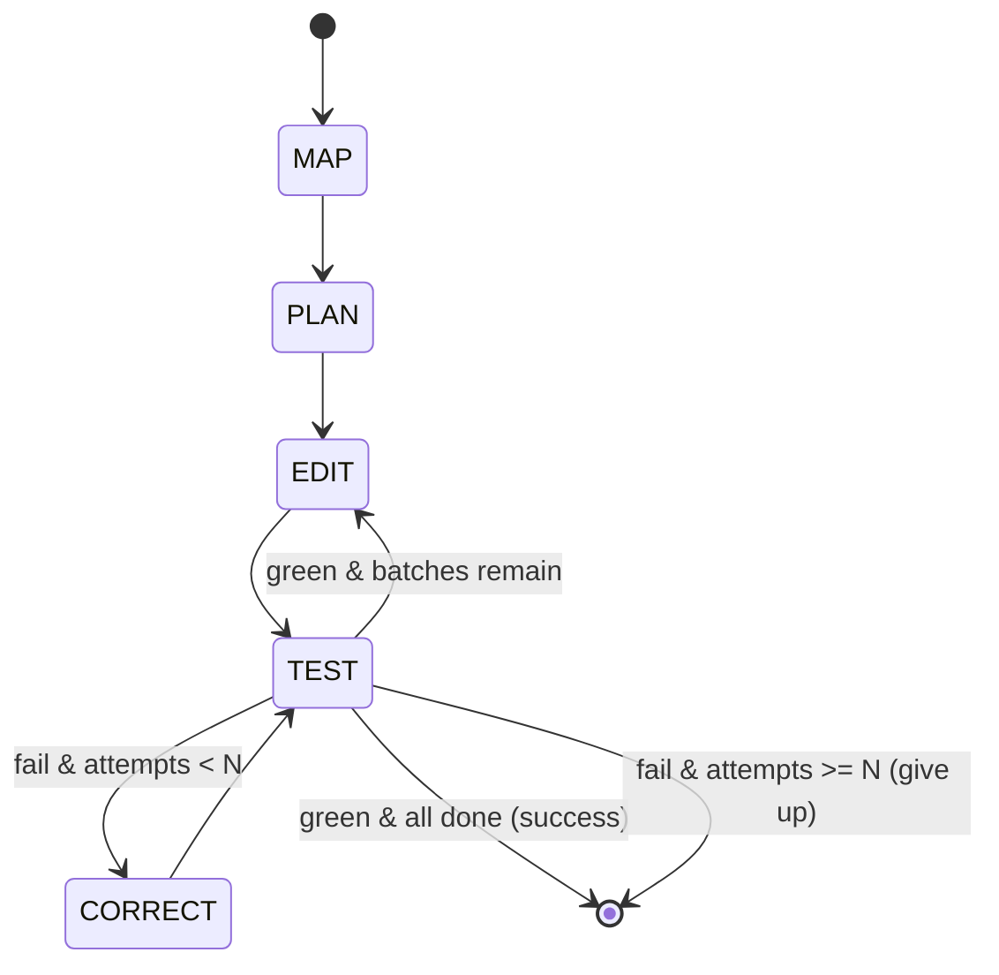

# Codebase-Wide Version Migration & Refactoring Agent (MRA)

> An autonomous agent that upgrades an entire Python codebase across a breaking library/language version change — mapping every affected call site with a dependency graph, planning a safe edit order, and running a test-driven self-correction loop until the suite passes.

**Status:** Academic major project (in development) · **Centre:** AI & ML · **Guide:** Dr Nimrita Koul · **Author:** Srinivas RC

<!-- Badges (fill in once CI exists): build · coverage · python 3.12 · license -->

---

## What this is

Upgrading a real codebase across a breaking change (e.g. **SQLAlchemy 1.4 → 2.0**, **Pydantic v1 → v2**) is not find-and-replace. One changed contract can break callers in many files, and some breaks are **semantic** — the code still imports but behaves differently, failing only at test time.

The MRA is a **long-horizon agent built as an explicit state machine (LangGraph 1.x)** with tools, graph-based memory, and a verification-and-recovery loop. It:

1. **MAP** — statically analyses the repo (`libcst`) and builds a dependency/call graph (`networkx`), finding every affected call site *before* editing.
2. **PLAN** — topologically orders the edits into safe batches (no circular regressions).
3. **EDIT** — applies deterministic edits as `libcst` codemods; uses an LLM only for ambiguous ones.
4. **TEST** — runs `pytest` + `ruff` inside an isolated Docker sandbox, capturing structured results.
5. **CORRECT** — on failure, parses the trace, locates the broken contract, patches it, and re-tests until green (or a retry ceiling is hit).

This is not a fancy find-replace. The **self-correction loop** and the **dependency-ordered editing** are the point.

## Architecture at a glance



Full component diagram and node contracts: [`docs/04_ARCHITECTURE_HLD_LLD.md`](docs/04_ARCHITECTURE_HLD_LLD.md).

## Tech stack

| Layer | Choice |
|---|---|
| Orchestration | LangGraph 1.x (explicit state machine) |
| State / audit log | `langgraph-checkpoint-sqlite` |
| Static analysis + codemods | `libcst` |
| Dependency graph | `networkx` |
| Verification | `pytest` + `pytest-json-report` + `ruff` |
| Git / patches | `GitPython` |
| Sandbox | Docker `python:3.12-slim` (or rootless Podman) |
| LLM (edits) | DeepSeek V4-Pro |
| LLM (summaries/classification) | DeepSeek V4-Flash |

Verified current as of Aug 2026. See [`docs/RESOURCE_PACK.md`](docs/RESOURCE_PACK.md) for versions and rationale.

## Repository structure

```
mra/
├── README.md
├── CLAUDE.md                     # instructions for AI coding assistants
├── CONFIGURATION.md              # how to set API keys & config (no secrets here)
├── .env.example                  # copy to .env and fill in (gitignored)
├── .gitignore
├── LICENSE
├── pyproject.toml
├── Dockerfile.sandbox
├── docs/
│   ├── 01_PROJECT_CHARTER.md
│   ├── 02_LITERATURE_REVIEW.md
│   ├── 03_SRS.md
│   ├── 04_ARCHITECTURE_HLD_LLD.md
│   ├── 05_DATA_EVALUATION_PROTOCOL.md
│   ├── RESOURCE_PACK.md
│   └── PRD.md
├── src/mra/
│   ├── __init__.py
│   ├── state.py                  # MigrationState (see SRS §4.1)
│   ├── graph.py                  # LangGraph wiring (nodes + edges)
│   ├── nodes/
│   │   ├── map_node.py           # static analysis -> call_sites + dep_graph
│   │   ├── plan_node.py          # topological batching
│   │   ├── edit_node.py          # codemod / LLM edits
│   │   ├── test_node.py          # sandbox pytest+ruff -> test_report
│   │   └── correct_node.py       # trace parse -> patch
│   ├── analysis/                 # libcst visitors, networkx graph builder
│   ├── codemods/                 # deterministic libcst transforms (per task)
│   ├── sandbox/                  # docker run wrappers, git snapshot/rollback
│   ├── models/                   # DeepSeek router, token accounting
│   └── metrics/                  # M1/M2/M3 computation
├── corpus/
│   ├── tierA/                    # controlled repos + ground_truth.json
│   └── tierB/                    # real OSS repos (tagged before/gold)
├── runs/                         # per-run outputs: patch, trajectory, metrics (gitignored)
└── tests/                        # unit tests for the agent itself
```

## Quickstart

Prerequisites: Python 3.12, Docker (or Podman), a DeepSeek API key.

```bash
# 1. clone + create environment
git clone <your-repo-url> && cd mra
python -m venv .venv && source .venv/bin/activate
pip install -e ".[dev]"

# 2. configure secrets (see CONFIGURATION.md — never commit .env)
cp .env.example .env
$EDITOR .env                      # add DEEPSEEK_API_KEY

# 3. build the sandbox image
docker build -f Dockerfile.sandbox -t mra-sandbox:py312 .

# 4. run a migration on a controlled task (analyse -> codemod -> verify -> score)
python -m mra.run --task-dir corpus/tierA/task01_datetime
```

Outputs land in `runs/<run_id>/`: the unified `migration.patch`, `trajectory.json`,
`metrics.json`, and the normalized `test_report.json`.

The recovery loop is exercised by `corpus/tierA/task03_half_migration`, which is
built to be broken: migrate two of its three call sites and the suite goes red
with `TypeError: can't subtract offset-naive and offset-aware datetimes`, and
the CORRECT loop has to finish the job. Its deterministic tests need no API key
— `pytest tests/test_recovery.py` runs the whole state machine offline and skips
only the live-model case.

## Evaluation

Three metrics, defined formally in [`docs/05_DATA_EVALUATION_PROTOCOL.md`](docs/05_DATA_EVALUATION_PROTOCOL.md):

- **M1 — Migration Completeness** (recall / precision / F1 over affected call sites)
- **M2 — Post-Migration Test Pass Rate** (with regression count)
- **M3 — Token / Step Overhead** (tokens, tool calls, cost, normalized per call site)

## Documentation index

| Doc | Purpose |
|---|---|
| [Project Charter](docs/01_PROJECT_CHARTER.md) | Scope, targets, deliverables, timeline (the guide contract) |
| [Literature Review / SOTA](docs/02_LITERATURE_REVIEW.md) | Why existing tools/agents fall short; the research gap |
| [SRS](docs/03_SRS.md) | Functional requirements, JSON contracts, boundaries, NFRs |
| [Architecture (HLD/LLD)](docs/04_ARCHITECTURE_HLD_LLD.md) | Components, state machine, dependency-graph logic |
| [Data & Evaluation Protocol](docs/05_DATA_EVALUATION_PROTOCOL.md) | Corpus, metric formulas, sandbox setup |
| [Resource Pack](docs/RESOURCE_PACK.md) | Verified stack, migration data, reference code |
| [PRD](docs/PRD.md) | One-page problem/scope/success framing |
| [CLAUDE.md](CLAUDE.md) | Conventions & guardrails for AI coding assistants |

## Roadmap (build phases)

- [x] **P0** Dockerized skeleton: `pytest` + `git` wrapped as tools
- [x] **P1** Static analyzer: call sites + dependency graph (deterministic)
- [x] **P2** Single-file edit + verify (end-to-end tiny agent)
- [x] **P3** Recovery loop (the graded core): classify -> locate -> patch -> re-test, capped per failure signature
- [ ] **P4** Multi-file + memory (state tracker + summarization)
- [ ] **P5** Benchmark + report + paper

## License

TBD — a permissive license (e.g. **MIT**) is recommended for an academic project you may open-source. Confirm with the guide/department before publishing.

## Acknowledgements

Project guide: **Dr Nimrita Koul**, Centre for AI & ML. Evaluation methodology adapted from SWE-bench (Jimenez et al., 2024).
