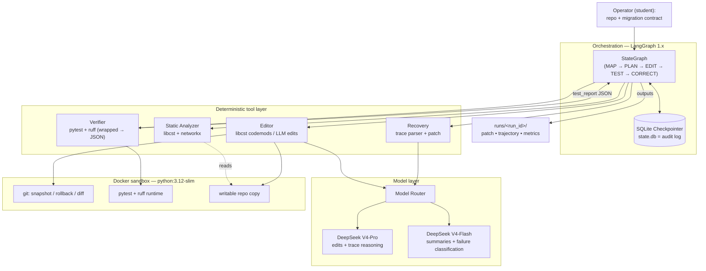
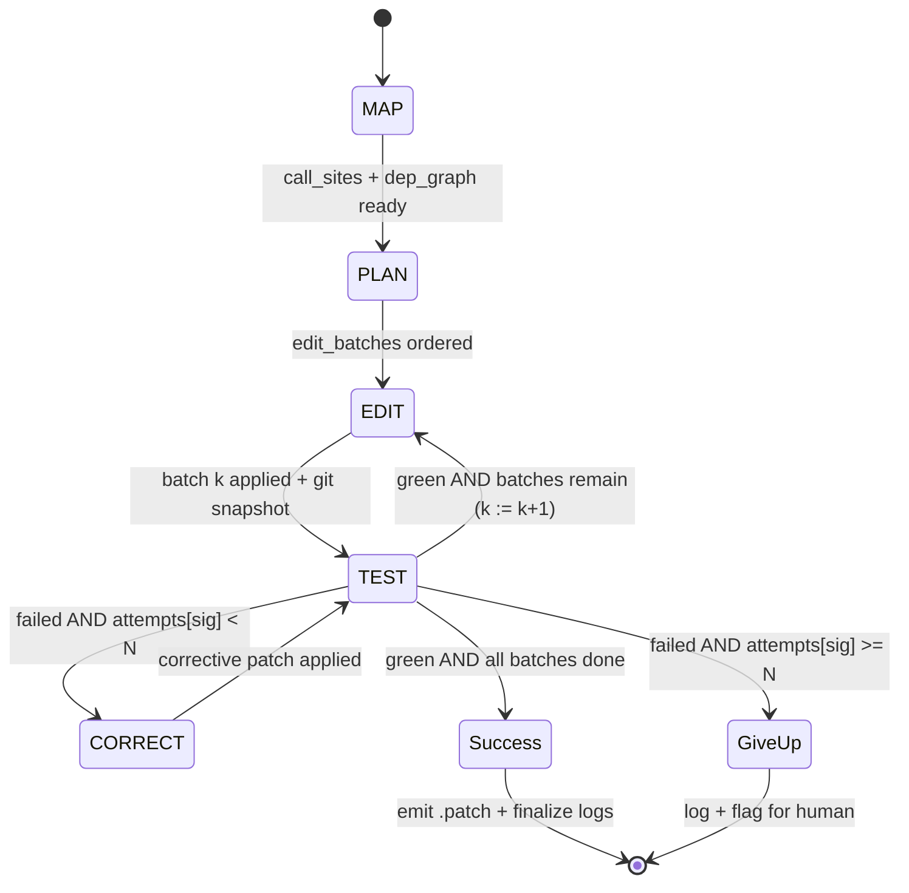
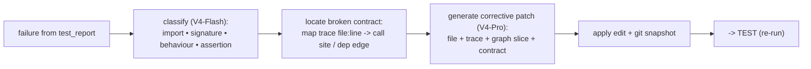
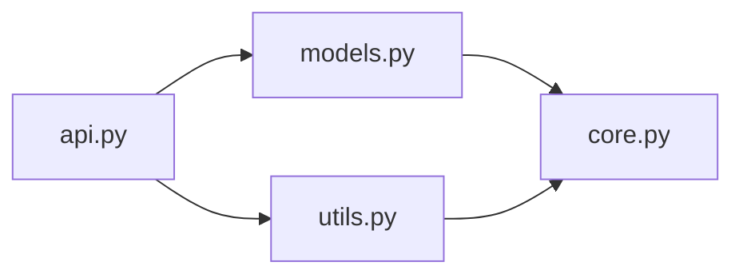

# System Architecture & Design (HLD + LLD)
### Codebase-Wide Version Migration & Refactoring Agent (MRA)

| Field | Value |
|---|---|
| **Document** | System Architecture & Design (Deliverable D4) |
| **Author** | Srinivas RC | **Guide** | Dr Nimrita Koul |
| **Version** | 0.1 (Draft) | **Date** | 24 August 2026 |
| **Status** | For guide review |

**Revision history**

| Ver | Date | Change |
|---|---|---|
| 0.1 | 24 Aug 2026 | Initial HLD, LLD state machine, dependency-graph logic spec |

> Diagrams are Mermaid (render on GitHub/GitLab/VS Code; export to PNG/SVG with `mmdc`). You should be able to reproduce the HLD component diagram and the state machine on a whiteboard from memory — if you cannot, you do not yet understand the system well enough to defend it.

---

## 1. High-Level Design (HLD)

### 1.1 Component diagram



### 1.2 Component responsibilities

| Component | Responsibility | Key tech | Reads | Writes |
|---|---|---|---|---|
| **Orchestrator** | Drives the state machine; owns `MigrationState`; enforces stop/retry conditions. | LangGraph 1.x | State | State, transitions |
| **SQLite Checkpointer** | Persists every transition; **is** the trajectory/audit deliverable. | `langgraph-checkpoint-sqlite` | — | `state.db` |
| **Static Analyzer** | Enumerates call sites (scope/alias-resolved); builds dependency graph. | `libcst`, `networkx` | repo | `call_sites`, `dep_graph` |
| **Planner** | Topological sort → ordered, batched edit plan. | `networkx`, LLM (structured) | graph, contract | `edit_batches` |
| **Editor** | Applies edits (codemod first, LLM fallback); preserves formatting. | `libcst`, V4-Pro | file, graph slice | edited files |
| **Verifier** | Runs `pytest` + `ruff` in sandbox; normalizes to `test_report` JSON. | `pytest-json-report`, `ruff` | repo | `test_report` |
| **Recovery** | Parses trace, classifies failure, locates broken contract, patches. | V4-Pro (+ V4-Flash classify) | `test_report` | corrective edit |
| **Model Router** | Routes call type → model; logs tokens/cost. | OpenAI SDK | prompts | tokens, cost |
| **Sandbox** | Isolated execution; git snapshot/rollback. | Docker, `git` | repo copy | test output, snapshots |

### 1.3 Data flow (one task, happy path then recovery)

1. Operator supplies repo + contract → Orchestrator initializes `MigrationState`, sandbox copies the repo, `git` snapshots.
2. **MAP:** Analyzer writes `call_sites` + `dep_graph`.
3. **PLAN:** Planner writes `edit_batches` (topological).
4. **EDIT:** Editor applies batch *k* (codemod or LLM), `git` snapshots.
5. **TEST:** Verifier runs suite → `test_report`.
6. Router (in Orchestrator): if green and batches remain → back to EDIT (k+1); if green and done → SUCCESS; if failed and attempts < N → **CORRECT**; if failed and attempts ≥ N → GIVE UP.
7. **CORRECT:** Recovery patches → back to TEST.
8. On SUCCESS: emit `.patch`, finalize trajectory + metrics under `runs/<run_id>/`.

### 1.4 Key architectural decisions (ADR summary)

| ID | Decision | Alternative rejected | Why |
|---|---|---|---|
| ADR-1 | LangGraph explicit state machine | Claude Agent SDK / autonomous shell agent | The loop, ordering, and memory are the graded artefact — they must be explicit and inspectable, not hidden. |
| ADR-2 | Hybrid edits: codemod-first, LLM-fallback | All-LLM edits | Deterministic edits are exact and zero-token; lowers M3 and raises reliability. |
| ADR-3 | SQLite checkpointer | Postgres | Single-run scale, not concurrent load; matches operator's existing stack; SQLite is sufficient. |
| ADR-4 | Multi-model router (Pro/Flash) | Single strong model everywhere | Cheap model for summaries/classification controls token overhead (graded). |
| ADR-5 | Docker sandbox per run | Run on host | Safety + reproducibility; a bad edit cannot touch the host. |
| ADR-6 | Static dependency graph before editing | Heuristic localization | The migration pattern is known, so exact call-site + import analysis beats heuristics and enables safe ordering. |

## 2. Low-Level Design (LLD) — the LangGraph state machine

### 2.1 State machine diagram



### 2.2 Nodes (contracts)

Each node is `state → partial state update`. Pure where possible; side effects (file writes, sandbox runs) are explicit.

| Node | Input it reads | Output it writes | Side effects |
|---|---|---|---|
| **MAP** | `repo_path`, `contract` | `call_sites`, `dep_graph`, `file_status=pending` | none (read-only analysis) |
| **PLAN** | `dep_graph`, `call_sites`, `contract` | `edit_batches`, `current_batch=0` | none |
| **EDIT** | `edit_batches[current_batch]`, `contract`, graph slice, rolling summary | edited files; `file_status` per file; `tokens` | file writes; `git` snapshot |
| **TEST** | `repo_path` | `last_test_report` | `pytest`+`ruff` run in sandbox |
| **CORRECT** | `last_test_report.failures[0]` | corrective edit; `fix_attempts[sig] += 1`; `tokens` | file writes |

### 2.3 Conditional routing after TEST (the graded logic)

```python
MAX_FIX_ATTEMPTS = 3

def route_after_test(state) -> str:
    r = state["last_test_report"]
    if r["failed"] == 0 and r["errors"] == 0:
        # batch is green
        if state["current_batch"] + 1 >= len(state["edit_batches"]):
            return "success"          # all batches done, suite green
        state["current_batch"] += 1
        return "next_batch"           # -> EDIT (k+1)
    sig = r["failures"][0]["signature"]
    if state["fix_attempts"].get(sig, 0) >= MAX_FIX_ATTEMPTS:
        return "give_up"              # same failure N times -> log + flag
    return "correct"                  # -> CORRECT -> TEST
```

### 2.4 Graph wiring (LangGraph 1.x)

```python
from langgraph.graph import StateGraph, START, END
from langgraph.checkpoint.sqlite import SqliteSaver

g = StateGraph(MigrationState)
for name, fn in [("map", map_node), ("plan", plan_node),
                 ("edit", edit_node), ("test", test_node),
                 ("correct", correct_node)]:
    g.add_node(name, fn)

g.add_edge(START, "map")
g.add_edge("map", "plan")
g.add_edge("plan", "edit")
g.add_edge("edit", "test")
g.add_conditional_edges("test", route_after_test, {
    "correct":    "correct",
    "next_batch": "edit",
    "success":    END,
    "give_up":    END,
})
g.add_edge("correct", "test")

with SqliteSaver.from_conn_string("runs/<run_id>/state.db") as saver:
    app = g.compile(checkpointer=saver)   # checkpointer = trajectory/audit log
```

### 2.5 Recovery-node internals (the hardest part)



Failure taxonomy (reuse the Debug.ext P0–P3 triage pattern), each with a fix strategy:

| Class | Symptom | Fix strategy |
|---|---|---|
| Import break | `ImportError` / `ModuleNotFoundError` | Add/adjust import per contract; re-check `expected_import_changes`. |
| Signature break | `TypeError: unexpected/positional arg` | Update callers found via dep graph; batch caller edits with the contract change. |
| Behaviour break | tests fail, no exception | Compare to `semantic_checks`; apply the semantic transform (e.g. timezone-aware). |
| Assertion break | `AssertionError` on value | Inspect expected vs actual; often a semantic default flip (e.g. httpx redirects). |
| Non-fixable | same signature ≥ N | Stop, log, flag for human. |

## 3. Dependency-graph logic specification

### 3.1 Why the graph exists
A migration changes a **contract** (a symbol's signature/behaviour). Every file that *uses* that symbol may break. Editing files in arbitrary order causes **circular regressions**: fixing file A breaks B, fixing B breaks A. The dependency graph makes edit order principled and makes each TEST meaningful.

### 3.2 Building the graph (`libcst` → `networkx`)
1. Parse each module with `libcst`; collect `Import` / `ImportFrom` nodes and resolve them to in-repo module paths (ignore third-party).
2. Add a directed edge **importer → imported** in a `networkx.DiGraph` (node = module file).
3. Separately, within each module, record `call_sites` of the migrated symbol (scope/alias-resolved) — this is what M1 scores against and what EDIT targets.


*(edge = "imports"; `core.py` is the most depended-upon module)*

### 3.3 Ordering rule (batching)
The naive "topological order" is not enough on its own, because a migration edits both a **definition** and its **callers**. The rule:

- **Group by contract unit.** When the contract changes a symbol defined in module *D*, the edit to *D* and the edits to all modules that call that symbol form **one batch** (or a small ordered set of batches), so that after the batch the tests exercising that contract are internally consistent. A caller must never be left calling the old contract while its dependency has moved to the new one *and be tested in between*.
- **Order batches by dependency depth.** Process leaf-most contracts first where independent, so earlier batches don't sit atop unmigrated dependencies. Compute an ordering with `networkx.topological_sort`; break the repo into independent components with `networkx.weakly_connected_components` and migrate them in parallel-safe order.
- **Handle cycles explicitly.** If import cycles exist (`networkx.simple_cycles`), collapse the cycle into a single batch — its members must be edited together, then tested once, because no safe internal order exists.

### 3.4 Pseudocode

```python
import networkx as nx

def plan_batches(dep_graph: nx.DiGraph, call_sites: dict) -> list[list[str]]:
    files_with_sites = {f for f in call_sites if call_sites[f]}
    # collapse import cycles: each cycle -> one atomic batch
    cycles = list(nx.simple_cycles(dep_graph))
    atomic = {frozenset(c) for c in cycles if len(c) > 1}
    # condensation gives a DAG over strongly-connected components
    cond = nx.condensation(dep_graph)            # DAG of SCCs
    order = list(nx.topological_sort(cond))       # dependency order
    batches = []
    for scc_id in order:
        members = set(cond.nodes[scc_id]["members"])
        batch = sorted(members & files_with_sites)
        if batch:
            batches.append(batch)                 # atomic per SCC
    return batches
```

### 3.5 Interaction with the loop
`plan_node` calls `plan_batches`; `edit_node` consumes `edit_batches[current_batch]`; a failure in TEST that traces to a caller in a *later* batch is a signal the ordering was wrong — logged as a planning defect and used in the paper's failure analysis. This closes the loop between the graph logic and the recovery loop.

---
*This document defines the engine. The HLD component diagram and the LLD state machine are viva-critical: rehearse drawing both without notes.*
